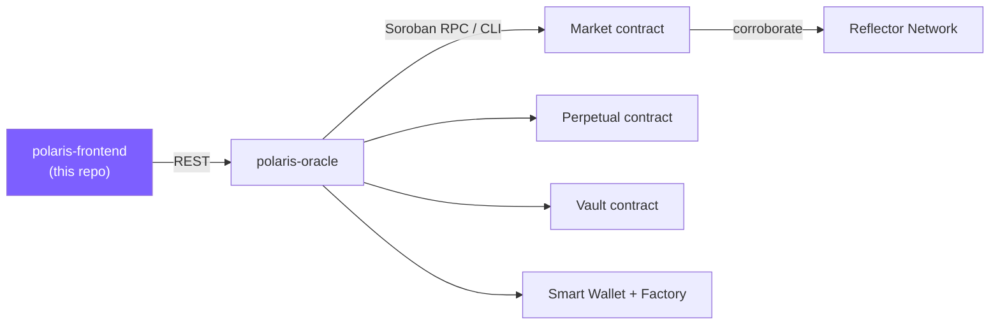

# polaris-frontend

[](https://github.com/only1dreamgene/polaris-frontend/actions/workflows/ci.yml)
[](./LICENSE)

Next.js 16 web app for **Polaris** — a fully-collateralized, non-custodial
prediction-market platform on Stellar. Trade binary markets and continuous
perpetuals, sign in with a passkey (no seed phrase, no browser extension),
and embed any market on a third-party site. Entirely backend-mediated:
every read and write goes through `polaris-oracle`'s REST API — there's no
direct Soroban RPC or wallet-extension SDK in this app at all.

This is one of three repos that make up Polaris:

| Repo | Role |
|---|---|
| [polaris-contracts](https://github.com/only1dreamgene/polaris-contracts) | The on-chain rules: markets, perpetuals, the LP vault, passkey wallets |
| [polaris-oracle](https://github.com/only1dreamgene/polaris-oracle) | NestJS backend — settlement automation, multi-oracle price relay, sponsored transactions, admin API |
| **polaris-frontend** (this repo) | The web app — this document |

## Live

**[polaris-frontend-delta.vercel.app](https://polaris-frontend-delta.vercel.app)** — deployed on Vercel, talking to the live [polaris-oracle](https://polaris-oracle.fly.dev) backend.

## Contents

- [Features](#features)
- [Tech stack](#tech-stack)
- [Architecture](#architecture)
- [Project layout](#project-layout)
- [Routes](#routes)
- [Running locally](#running-locally)
- [Testing](#testing)
- [Deployment](#deployment)
- [Design notes](#design-notes)
- [Verified live: the real WebAuthn path](#verified-live-the-real-webauthn-path)
- [Known gaps](#known-gaps)

## Features

- **Passkey sign-in, no seed phrase.** WebAuthn (Face ID / Touch ID /
  Windows Hello) registers a Soroban smart-wallet address; the backend
  sponsors every gas fee.
- **Email login** as a custodial alternative for users who'd rather not
  use a passkey.
- **Classic binary markets** — buy YES/NO, watch a live AMM-implied price,
  redeem after settlement or cancellation.
- **Perpetual markets** — the same trading mechanics with no expiry, its
  own list/detail pages and trade widget.
- **Embeddable market widget** — any market can run inside a third-party
  site's `<iframe>` via a generated embed snippet, passkey and all.
- **A real result-reveal moment** — the page updates live (short-interval
  polling) the instant a market resolves, showing win/loss/refund without
  a manual refresh.
- **Admin dashboard** — sectioned nav (Overview, Markets, Fee Revenue,
  Treasury, Wallets, Blockchain, Fraud & Trust, Perpetuals), gated behind
  an admin key, entirely read-only against `polaris-oracle`'s admin API.
- **Public docs page** — the trust model and mechanics, in plain language,
  for anyone who wants to verify how the system actually works.

## Tech stack

| | |
|---|---|
| Framework | [Next.js](https://nextjs.org) 16 (Turbopack), App Router |
| UI | React 19, Tailwind CSS 4 |
| Data fetching | [TanStack Query](https://tanstack.com/query) |
| Auth | WebAuthn (native browser API) via `lib/webauthn.ts` |
| Testing | [Vitest](https://vitest.dev) — `amm.spec.ts`, `portfolio.spec.ts`, `webauthn.spec.ts` |
| Deployment | [Vercel](https://vercel.com) |

## Architecture



## Why no Freighter

The original spec's frontend used a Freighter browser-extension wallet for
every bet. This build replaces that with passkey smart wallets end to end
— bettors never hold a browser extension or a seed phrase — and admin
actions are always backend-mediated via a shared API key, never a wallet
signature. Once both of those are true, there's no remaining role for
Freighter to play.

## Project layout

| Path | Purpose |
|---|---|
| `lib/webauthn.ts` | Passkey register/sign. The one piece of real crypto math here: browsers return DER-encoded, non-normalized ECDSA signatures; the contract needs raw r‖s, low-S normalized. Verified in `webauthn.spec.ts` (real keypairs, real signatures, no browser needed). |
| `lib/passkey-wallet.ts` | Orchestrates onboarding (register passkey → backend deploys a smart wallet) and the two-step sponsored-transaction flow (prepare → sign → submit). |
| `lib/portfolio.ts` | Mirrors the contract's redemption math for position values. Verified in `portfolio.spec.ts`. |
| `lib/amm.ts` | Mirrors the contract's constant-product swap math, to give `buy` a real slippage floor. Verified in `amm.spec.ts`. |
| `lib/api.ts` | Typed client for every `polaris-oracle` endpoint this app uses. |
| `lib/format.ts` | Centralizes amount/status/address formatting and resolution-polling helpers. |
| `app/(app)/*` | Dashboard, market/perpetual detail + trade form, portfolio — share the topbar shell. |
| `app/docs/` | Public docs page, outside the `(app)` route group. |
| `app/embed/[id]/` | The embeddable market widget. |
| `app/admin/*` | The admin dashboard — its own top-level route group with its own sidebar shell. |
| `components/perpetual-trade-card.tsx` | The perpetual contract's own trade widget — a separate component from `trade-card.tsx`, not a `kind`-parameterized shared one (the trading *model* differs enough to matter for UI, not just data). |
| `components/embed-code-button.tsx` | Generates the `<iframe>` snippet shown on the market detail page. |
| `components/result-reveal.tsx` | The one deliberate "moment" in this app — see [Design notes](#design-notes). |

## Routes

| Route | Purpose |
|---|---|
| `/` | Landing / dashboard |
| `/markets` | Classic market list |
| `/market/[id]` | Classic market detail + trade |
| `/perpetuals` | Perpetual market list |
| `/perpetual/[id]` | Perpetual detail + trade |
| `/bets` | Portfolio |
| `/create` | Admin-gated market creation |
| `/docs` | Public trust-model documentation |
| `/embed/[id]` | Embeddable market widget (iframe target) |
| `/welcome` | Onboarding |
| `/admin` | Admin dashboard home |
| `/admin/markets`, `/admin/perpetuals` | Lifecycle actions (settle, cancel, terminate, checkpoint) |
| `/admin/fee-revenue`, `/admin/treasury`, `/admin/wallets`, `/admin/network`, `/admin/settlement-checks` | Read-only dashboard sections |

## Running locally

```sh
cp .env.local.example .env.local   # NEXT_PUBLIC_ORACLE_URL must point at a running polaris-oracle
npm install
npm run dev      # http://localhost:3000
```

## Testing

```sh
npm test          # vitest run — amm.spec.ts, portfolio.spec.ts, webauthn.spec.ts
```

This ran with no test framework at all until an audit pass added one — the
pure-logic pieces (AMM math, redemption math, the WebAuthn signature
conversion) had been verified with hand-run standalone scripts instead.
Those worked, but nothing forced them to be re-run: `lib/portfolio.ts`'s
mirror of the contract's redemption math drifted out of sync with a real
contract fix for one full pass before a real test caught it. The scripts
are gone now, migrated into `*.spec.ts` files colocated with the code they
cover.

## Deployment

Deployed on [Vercel](https://vercel.com). Production build:

```sh
vercel --prod
```

Two environment variables matter in production:

| Variable | Purpose |
|---|---|
| `NEXT_PUBLIC_ORACLE_URL` | The `polaris-oracle` API this app talks to |
| `NEXT_PUBLIC_WEBAUTHN_RP_ID` | Must exactly match the deployed domain — WebAuthn's relying-party id is tied to it, and a mismatch silently breaks every passkey prompt |

## Design notes

### Embedding a market

Any market can run inside a third-party site via `/embed/[contractId]` — a
"Get embed code" button on the market detail page generates the snippet.
Two things about it are load-bearing, not incidental:

1. **It has to be served from this app's own origin, not `polaris-oracle`'s.**
   WebAuthn's relying-party id is tied to the document's origin a passkey
   was registered against. Same origin is what makes a passkey a
   *portable* identity across every embed of this app.
2. **The embedding page's `<iframe>` needs `allow="publickey-credentials-get
   *; publickey-credentials-create *"`.** Without it, every passkey prompt
   inside the iframe fails silently. `next.config.ts` sets the
   response-side `Permissions-Policy` header to match, but that's the
   other half of the handshake, not a substitute for the `allow` attribute.

**Bundle size, measured rather than assumed:** loading `/embed/[id]` in a
real browser transfers ~562kb (~524kb JS) total; `/market/[id]` is
actually *larger* (~623kb/~559kb), mostly from Next's automatic
prefetching of the nav's other routes.

### Making the blockchain invisible

An audit of every place blockchain vocabulary or a raw on-chain value
reached end-user UI found the formatting layer was already clean
(`lib/format.ts`, consistently used everywhere) — the actual gaps were
vocabulary and two small real bugs, both fixed:

- `trade-card.tsx` and `embed/[id]/page.tsx` set their error state from
  the raw thrown error instead of the shared API-error unwrapper,
  meaning a raw `400 {...}` or on-chain revert string could reach a user.
- Both also rendered a full, unlinked transaction hash after a
  trade/redeem — replaced with a short reference.
- Copy sweep: "on-chain", "Soroban", and "Built on Stellar" language
  removed from end-user-facing strings in favor of the same true facts
  stated as outcomes ("settled automatically by a live price feed"
  instead of "settled on-chain by Pyth"). XLM amounts are left exactly as
  they were — that's real financial information, not implementation
  detail to hide. `/docs` is deliberately untouched: its whole purpose is
  transparency for anyone who wants to verify the trust model.

### The result-reveal moment

The one deliberate "moment" in this app: what a bettor sees the instant
their market resolves, rather than a plain "Trading is closed" line.

1. **The transition actually had to be caught.** Fixed with a
   function-form `refetchInterval` (8s) that polls while a market is
   `'watching'`/`'pending'` and stops once it's genuinely terminal. This
   is short-interval polling, not real push — no websocket/SSE exists in
   `polaris-oracle` — stated plainly rather than oversold.
2. **The decision logic is reused, not re-derived.** `ResultReveal`
   computes win/loss/refund via the existing `didWin()`/`redeemableValue()`
   in `lib/portfolio.ts`, not a second copy of that math.

The embed page gets the same component (`compact` prop) rather than a
third copy of this logic.

**Verified live on testnet**: a real wallet with a real position on a
cancelled market showed the exact expected refund amount, and a real
email-login wallet's trade, left open through a real expiry and grace
period with no reload, transitioned correctly via the polling above.

### Admin dashboard

Rebuilt from a single flat page into a real sectioned dashboard — grouped
sidebar nav: **Platform** (Overview), **Finance** (Markets, Fee Revenue,
Treasury), **Infrastructure** (Wallets, Blockchain, Fraud & Trust). Two
structural decisions worth knowing if you're extending this:

1. `/admin` lives in its own top-level `app/admin/*` route group, not
   nested in `(app)` — a nested layout can only *add* to a parent's
   chrome, never replace it, and the dashboard needed a full-bleed shell
   with no public-site nav above it.
2. `AdminKeyProvider` (scoped to `/admin/*`) gates the whole tree behind a
   key-entry screen, probing once per key change rather than once per
   navigation. It's still only a convenience gate — the key lives in
   `sessionStorage`, real enforcement stays 100% server-side in
   `polaris-oracle`'s `AdminGuard`.

No chart-library dependency — a small `BarList` component (a fixed
two-value split, not an arbitrary ranked list) covers Fee Revenue's
per-market breakdown and Overview's status counts.

### Perpetual markets

A second, continuous-trading contract kind — no strike price, no expiry,
no resolution event. Its own route family (`/perpetuals`,
`/perpetual/[id]`, `admin/perpetuals`) rather than folded into the
existing markets pages with a type badge.

**A new `PerpetualTradeCard`, not a `kind`-parameterized `TradeCard`.**
The two contracts share `buy`'s exact mechanics, but the *trading model*
differs in a way that matters for the UI: a classic market is "place a
bet, wait for one resolution event," none of which a perpetual has (every
complementary pair pays the same 0.5 XLM regardless of side once
`terminate()` fires). `PerpetualTradeCard` reuses the low-level pieces
that *are* generic (`OddsBar`, the AMM math helpers, `callAsWallet`, and
`redeemableValue`'s `'Cancelled'` case for `Terminated`'s identical math)
rather than reimplementing any of them.

**Scope this round**: buy + redeem-after-`terminate()` only — the same
scope classic markets' own trade card has today
([tracked as an open issue](https://github.com/only1dreamgene/polaris-frontend/issues/1)
for classic markets,
[and here](https://github.com/only1dreamgene/polaris-frontend/issues/2)
for perpetuals).

`admin/perpetuals` has a `Checkpoint` button alongside `Terminate` — calls
the backend's checkpoint endpoint and shows the result's price inline.

## Verified live: the real WebAuthn path

Every other check of this flow verified either the *signature math*
(`webauthn.spec.ts`) or the *deploy/trade plumbing* (email login, which
bypasses the browser ceremony entirely). Neither exercises
`navigator.credentials.create()`/`.get()` themselves.

Closed that gap by driving a real, headless Chromium instance (Playwright)
against the actual running app, with Chrome DevTools Protocol's `WebAuthn`
domain providing a virtual platform authenticator — every layer above the
literal fingerprint sensor is real: the browser's own WebAuthn
implementation, `registerPasskey()` / `signWithPasskey()`, the real
DER→raw-lowS conversion, the real backend relay, the real on-chain
`__check_auth` verification.

Result, clicking through the actual UI (sign in with passkey → buy YES):
- A real wallet deployed and auto-funded on testnet through the factory
  (see `polaris-contracts`'s README, "Factory wasm pinning").
- A real signed trade: `tx/prepare` → a genuine WebAuthn assertion from
  the virtual authenticator → `tx/submit` → confirmed on testnet,
  `getTransaction` status `SUCCESS`.
- The AMM pool and the wallet's own position moved by exactly the amounts
  the UI predicted before the click.

What's still outstanding after this is narrow: only the literal hardware
prompt (a real Face ID/Touch ID/Windows Hello dialog) hasn't fired — an
OS/browser-level interaction, not something this codebase's own logic
could behave differently for.

## Known gaps

- The full register→sign→submit WebAuthn path has been exercised through
  a real browser end to end against real testnet (above). What's still
  outstanding is narrower than "hasn't been tested at all": a literal
  hardware authenticator prompt hasn't pressed the button — an
  OS/browser-level interaction, not something CI can exercise regardless.
- Portfolio values are current-position marks, not historical realized
  P&L — see `lib/portfolio.ts`'s doc comment and the `/docs` page for why.
- Cross-origin `navigator.credentials.get()` (signing with an existing
  passkey, e.g. inside `/embed`) is broadly supported; cross-origin
  `navigator.credentials.create()` (registering a *new* passkey) has
  narrower support and notably isn't supported in Safari as of this
  writing. Signing in on the flagship app first, then returning to the
  embed to trade, works around it.
- Classic markets and perpetuals don't yet expose a `Sell` action in the
  UI — buy + redeem-after-resolution only (see the linked issues above).

## License

[MIT](./LICENSE)
